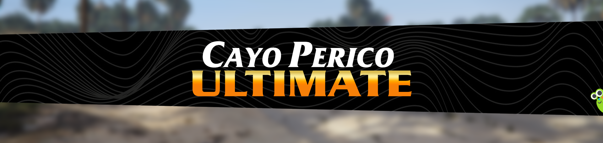
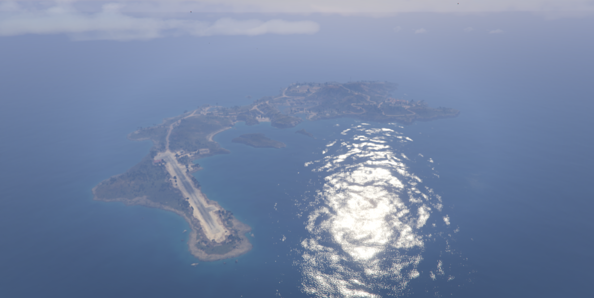
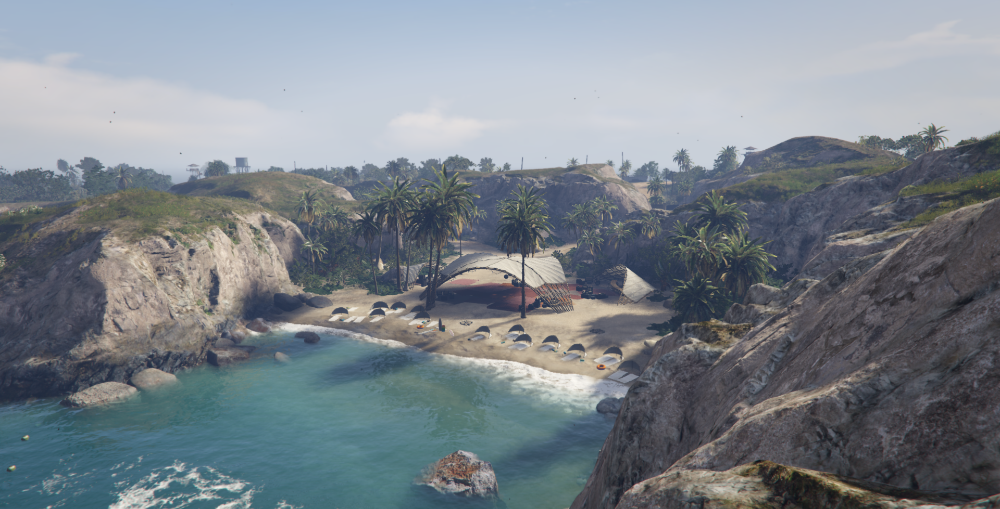
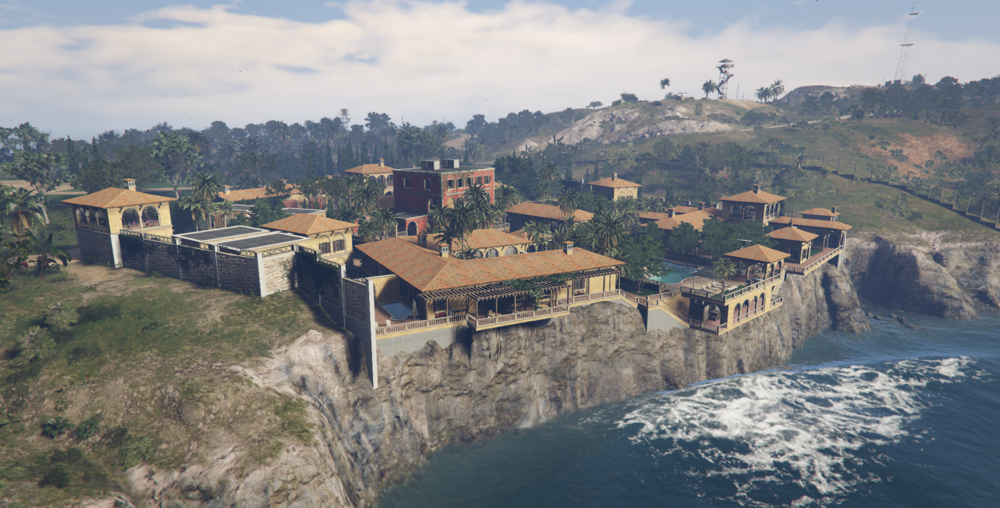
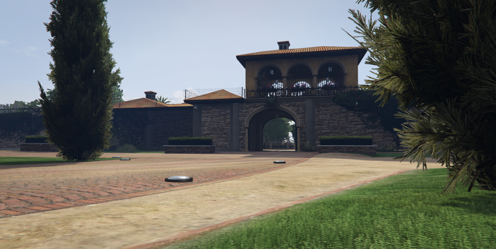
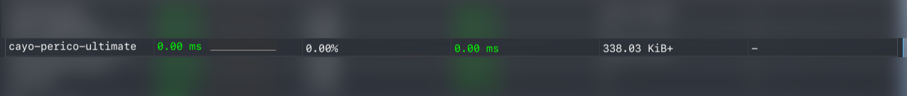

# Cayo Perico Loader - Ultimate Edition. Lightweight, Customizable, Upgraded


# Images
Yet another Cayo Perico loader... but with some improvements. Most loaders I've seen are horrendously unoptimized and lack ease of customization. We solve all of these problems, along with many other improvements.






# Features
- Cayo Perico loaded via IPL calls, no unnecessary streamed assets.
- Customizable map sections (see "Config" section below)
- Compatible with [LS-Removed](https://forum.cfx.re/t/release-los-santos-removed-empty-game-map-only-water/5176084) and [Extra-Map-Tiles](https://forum.cfx.re/t/release-extra-map-tiles-v2-add-extra-textured-tiles-on-the-pause-menu-map-and-minimap-new-and-revamped-version/5344181).
- Toggleable airstrip hangar door and mansion gates.
- Removed invisible collisions on the hills and in the party area.
- Removed prologue snow effects.
- Fixed hangar HD LOD disappearing.
- Dynamic wave and path node toggling between calm water in Cayo and waves in Los Santos.
- Fixed the water clipping through Cayo Perico in some areas.
- Compatible with any framework (ESX, QB, etc.)
- Compatible with the Rockstar Editor.
- No bloatware ymaps/props/peds/vehicles.

### Note: If you were running LS-Removed along with a streamed version of Cayo Perico, I encourage you to update to the newest version of LS-Removed that allows loading DLC IPLs and use a Cayo Perico IPL loader, such as this one.

# Config
```lua
config.cayo_perico = true   -- Master switch for Cayo Perico, if this is false, the resource will do nothing

-- Misc options
config.disable_prologue_snow = true -- true = disable snow from North Yankton, false = enable snow
config.disable_emitters = true -- true = disable arena wars emitters, false = enable emitters; set this to false if other scripts interact with emitters
config.peds = false  -- true = peds will spawn on the island, false = no peds will spawn
config.ambient_zone = true  -- true = enable ambient zones (birds, insects, etc), false = disable ambient zones
config.disable_radio = false -- true = disable car radio when on Cayo Perico, false = enable car radio on Cayo Perico

-- Map options
config.vault_entity_set = 'pink_diamond_set' -- options: 'panther_set', 'pearl_necklace_set', 'pink_diamond_set', nil (disables the entity set)
config.hangar_open = true   -- true = hangar door open; false = hangar door closed
config.gate_open = true    -- true = mansion gate open; false = mansion gate closed
config.underwater_gate_closed = false   -- true = underwater gate closed; false = underwater gate open
config.sea_mines = false  -- true = enable sea mines, false = disable sea mines
config.shark = true         -- true = enable dead shark, false = disable dead shark
config.whale = true          -- true = enable beached whale, false = disable beached whale 

-- Minimap options
--[[
    [*] If you use anything else than 'compact', I highly encourage you to use the Extra Map Tiles resource (link below).
    It has much better performance, and has better and easier customizability options.
    https://forum.cfx.re/t/release-extra-map-tiles-v2-add-extra-textured-tiles-on-the-pause-menu-map-and-minimap-new-and-revamped-version
]]
config.minimap_type = 'off' -- options: 'compact', 'scaleform', 'off'
config.gps = true   -- true = enable GPS routes on Cayo Perico, false = disable GPS routes on Cayo Perico; [*] Setting this to true will disable LS GPS routes
config.dynamic_path_nodes = true   -- true = dynamically enable/disable GPS path nodes when entering/exiting Cayo Perico, false = no GPS path nodes on Cayo Perico

-- Water options
config.dynamic_waves = true -- true = dynamically change wave intensity when entering/exiting Cayo Perico, false = default wave intensity on Cayo Perico
config.dynamic_waves_scaler = 1.0   -- wave scaler values when the player is not near Cayo Perico, only used if dynamic_waves is true

config.custom_water_name = 'cayo_water' -- specify a water entry to load from the table below or nil to disable
config.custom_water = {
    ['cayo_water'] = {
        resource_name = GetCurrentResourceName(), path = 'data/water_ls_cayo.xml', global_water_type = 1, deep_ocean_scaler = 0.0
    },

    -- Other example
    -- ['custom_water_2'] = {
    --     resource_name = 'other_resource_name', path = 'path/to/water.xml', global_water_type = 1, deep_ocean_scaler = 0.0
    -- }
}

config.dynamic_actions_delay = 3000 -- delay in ms for updating path nodes state and wave scaler; 3000 should be perfectly fine
```

# Known Limitations
- Hot reloading might lead to game crashes.

# Performance
This resource basically takes up no CPU cycles, having in most cases 0.00ms. If you are running the scaleform minimap, expect the process time to go up to 0.01-0.02ms, but I strongly discourage using the Scaleform map, as stated before.


# Support and bug-reporting
If you require any help, have found a bug with this resource, or have a feature request, either leave a reply in this thread, in my forum PMs or Discord DMs. I read and reply to everything. As always, feedback is very much appreciated.

# My other resources
[Carrier Operations](https://forum.cfx.re/t/release-carrier-operations-working-aircraft-carrier-mechanics/5180887) - Working aircraft carrier mechanics.
[Los Santos Removed](https://forum.cfx.re/t/release-los-santos-removed-empty-game-map-only-water/5176084) - Empty game map.
[Vehicle Helmets](https://forum.cfx.re/t/release-vehicle-helmets-wear-hats-and-helmets-inside-vehicles/5181880) - Wear hats and helmets inside vehicles.